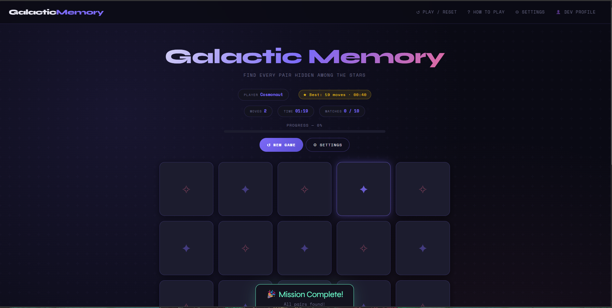

# 🌌 Galactic Memory

A star Wars-themed card flip memory game built with vanilla JavaScript ES Modules, Bootstrap 5, and full WCAG AA accessibility. Match all pairs in as few moves as possible to complete your Galactic mission!

---

## 🎯 Game Objective

Reveal all matching pairs of Star Wars symbol cards. The board is shuffled each round. Fewer moves = higher score. Beat your best!

## 📋 Rules

1. Click any face-down card to flip it and see its symbol.
2. Click a second card — if the symbols match, both stay face-up.
3. If they don't match, both flip back after a short delay.
4. Remember positions to make better guesses on future turns.
5. Match all pairs to win. Your move count and time are recorded.
6. Lower move count = better score. High scores are saved per difficulty.

---

## 🛠️ Tech Stack

| Layer        | Tech                                  |
|--------------|---------------------------------------|
| Markup       | HTML5 (semantic, valid)               |
| Styles       | CSS3 (custom properties, grid/flex)   |
| Components   | Bootstrap 5.3 (Navbar, Modal, Progress) |
| Scripting    | Vanilla JS — ES Modules               |
| Fonts        | Google Fonts — Syne + Space Mono      |
| Persistence  | `localStorage` + `document.cookie`   |
| Deployment   | GitHub Pages                          |

---

## 🗂️ Directory Layout

```
/(root)
  index.html          ← Main game page
  README.md
  /scripts
    cards.js          ← Card data + shuffle + deck builder
    game.js           ← Core game logic (rendering, state, events)
    storage.js        ← localStorage + cookie helpers + high scores
  /styles
    game.css          ← Custom stylesheet (Google Font, CSS vars, etc.)
  /images
    wireframe.svg     ← UI wireframe
  /pages
    profile.html      ← Developer profile page
```

---

## 🖼️ Wireframe

The wireframe below shows the intended layout before coding began:



Key areas shown:
- **Navbar** — brand, Play/Reset, How to Play, Settings, Dev Profile links
- **Stats bar** — moves, timer, matches chips
- **Progress bar** — visual match progress
- **Game board** — dynamically rendered card grid
- **Controls** — New Game and Settings buttons
- **Instructions** — numbered rules section
- **Footer** — project and validator links

---

## 🔗 Resources

- [Bootstrap 5 Docs](https://getbootstrap.com/docs/5.3/)
- [MDN — ES Modules](https://developer.mozilla.org/en-US/docs/Web/JavaScript/Guide/Modules)
- [MDN — CSS Custom Properties](https://developer.mozilla.org/en-US/docs/Web/CSS/Using_CSS_custom_properties)
- [MDN — Constraint Validation API](https://developer.mozilla.org/en-US/docs/Web/API/Constraint_validation)
- [Google Fonts — Syne](https://fonts.google.com/specimen/Syne)
- [Google Fonts — Space Mono](https://fonts.google.com/specimen/Space+Mono)
- [WCAG 2.1 AA Guidelines](https://www.w3.org/WAI/WCAG21/quickref/)
- [Nu HTML Validator](https://validator.w3.org/nu/)
- [WAVE Accessibility Checker](https://wave.webaim.org/)
- [Claude AI](https://claude.ai/new)
- [Youtube](https://www.youtube.com/watch?v=rcWBLFXH7uA)

---

## ✅ Accessibility Notes

- All interactive elements have `aria-label` attributes.
- An `aria-live="polite"` region announces matches and game events to screen readers.
- The game board is keyboard navigable (Tab → Enter/Space to flip cards).
- All visible focus outlines meet WCAG AA contrast.
- Animations respect `prefers-reduced-motion` — all transitions and card-flip animations are disabled if the user has reduced motion enabled.
- Color contrast for all text meets WCAG AA (4.5:1 for body text, 3:1 for large text).

---

## 🐣 Easter Egg

Open your browser console and type:

```js
cosmicSecret()
```

...for a surprise! 🎉

---

## 🚀 Deployment

This project is deployed to GitHub Pages from the `main` branch root.

**Live URL:** `https://tcbrakefield2.github.io/galactic-memory-game/`
